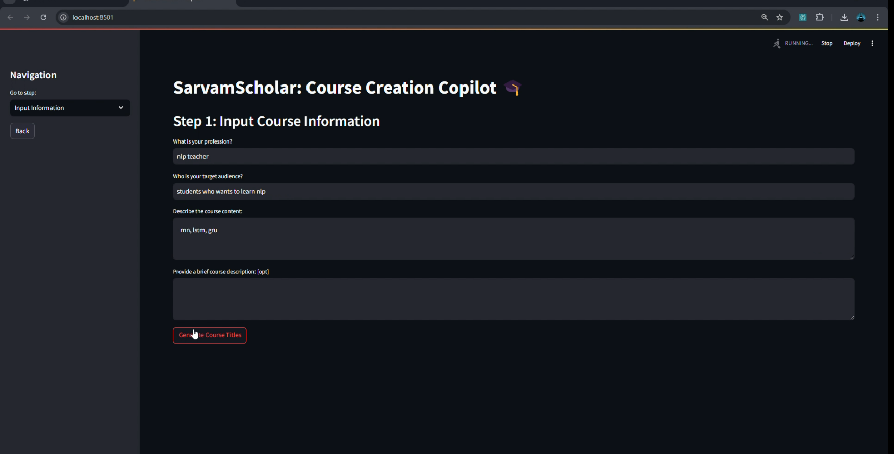
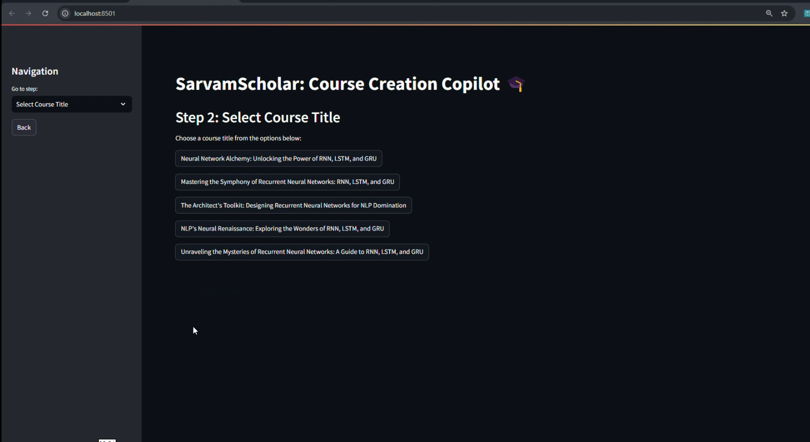
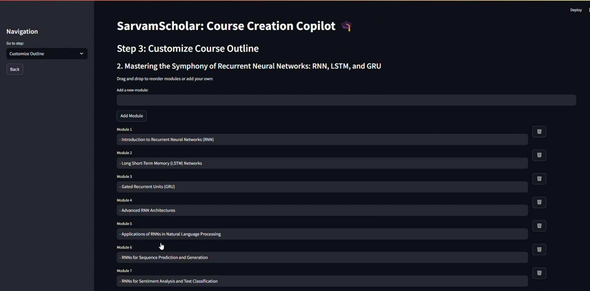
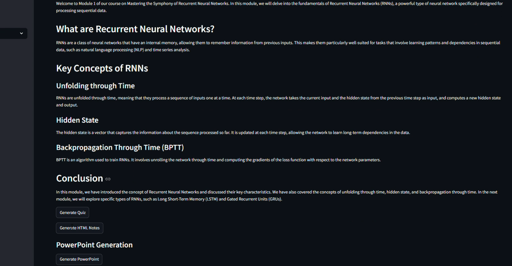
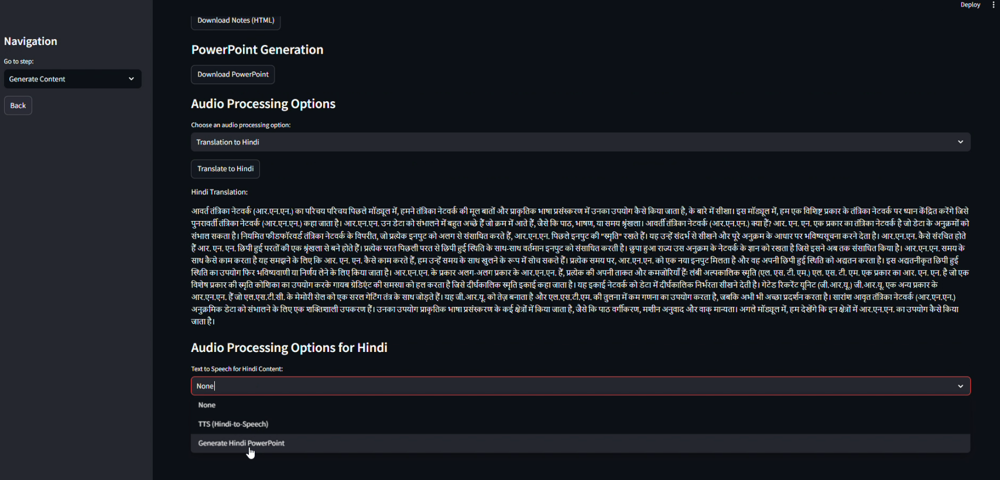

# SarvamScholar: Course Creation Co-Pilot

### *Your Course Creation Co-Pilot: Because Teaching Shouldn’t Feel Like Rocket Science!*

This project accelerates course creation by providing AI-powered copilots for translating content, generating voiceovers. By integrating Sarvam and Gemini APIs, it simplifies translation, TTS, and lecture generation, modifying (adding/removing) course outlines, along with quiz, ppt, notes generation (related to the course module), reducing the time to create high-quality online courses. GenAI excels at content generation, personalizing modules, and refining educational experiences through rapid, scalable, and production-grade outputs, making it the ideal solution for this challenge.

## Installation

Follow these steps to set up the project:

1. **Clone the Repository**: Run `git clone https://github.com/nihilisticneuralnet/SarvamScholar.git` to clone the repository to your local machine.

2. **Install Dependencies**: Navigate to the project directory and install the required packages by running `cd <repository-directory>` followed by `pip install -r requirements.txt`. 

3. **Set Up Environment Variables**: In the `.env` file in the project root directory and insert your Gemini and Sarvam API keys as follows:
   ```plaintext
   GEMINI_API_KEY=<your-gemini-api-key>
   SARVAM_API_KEY=<your-sarvam-api-key>
   ```
   Replace `<your-gemini-api-key>` and `<your-sarvam-api-key>` with your actual API keys.

4. **Run the Application**: Finally, run the application using Streamlit by executing `python -m streamlit run app.py`.

Ensure you have all the necessary libraries installed before running these commands.

## Architecture Flow

[//]: 


## Results

### Image Outputs

 1: Input your Course Content | 2. Select Course Title | 3. Customize Course Outlines | 4. Course Content | 5. Hindi Translation of the Content | 
| --- | --- | --- | --- | --- | 
|  |  |  |  |  | 

### Audio Ouput

[//]: [version1]https://github.com/user-attachments/assets/94df8627-387c-4b3f-8fac-f18add1e6194

https://github.com/user-attachments/assets/93bdcb6e-f513-4b15-a21c-aae37a567aea


### Video Outputs

Working of the system

[//]: https://github.com/user-attachments/assets/f1824f38-9d34-4135-9985-06a499fea5d7

Part 1:

https://github.com/user-attachments/assets/2f03d79c-2ddb-4e63-bd7a-4e7fee40a99b

Part 2:

https://github.com/user-attachments/assets/736bf265-1cf1-48fe-8082-be372ec3d9db


Output of AI Avatar using 'DreamTalk'

[//]: [version1]https://github.com/user-attachments/assets/ef567f2c-0951-4017-8329-0c22767b8321


https://github.com/user-attachments/assets/3d9d0128-4981-4d71-aa00-59f3112ecea8


## Revnue

### Freemium Model
- Free Basic Access: Offer free access to basic course creation features, such as generating course outlines or short quizzes.
  
- Premium Features: Charge for advanced features like AI avatars (e.g., DreamTalk), multilingual content generation, voiceovers, detailed presentations, and full-fledged course generation.

#### Subscription Tiers:

- Basic Tier: Limited content creation (e.g., one course per month).

- Pro Tier: Unlimited courses, access to premium AI-generated content (videos, images), advanced customization options.

- Enterprise Tier: Custom solutions for educational institutions or businesses with bulk content needs, advanced integrations, and dedicated support.


## Next steps

Here are some things I may want to do.

- Frontend/Backend: Work on Frontend/ Backend for scalability, good UI design instead of Streamlit

- AI Avatar: Integrate AI Avatar (which can act as an instructor for the course) using '[DreamTalk](https://huggingface.co/spaces/fffiloni/dreamtalk/tree/main)'

- Image Generation: Use VertexAI (Imagen) for image generation
  
- Video Generation: Generate Video for each module using [AnimateLCM](https://huggingface.co/wangfuyun/AnimateLCM)

- Languages: For prototype purposes, I have only written the code for Hindi language. Bring more languages into the code

- Prompt-Tuning: For further optimization of LLM responses

- Additional Inputs: Take input as Pdf or a Youtube link and parse it for specific content generation

- RAG: Implement RAG model to verify the content generated accuracy


## References

- https://ai.google.dev/gemini-api/docs/api-key
- https://www.sarvam.ai/
- https://huggingface.co/spaces/fffiloni/dreamtalk/tree/main
- https://github.com/camenduru/dreamtalk-colab
- https://huggingface.co/wangfuyun/AnimateLCM
